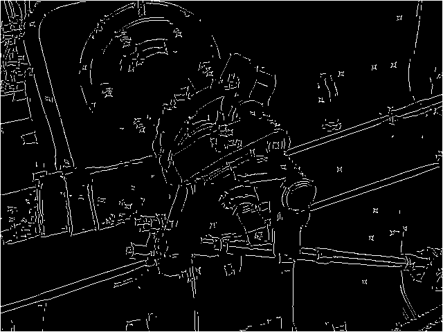
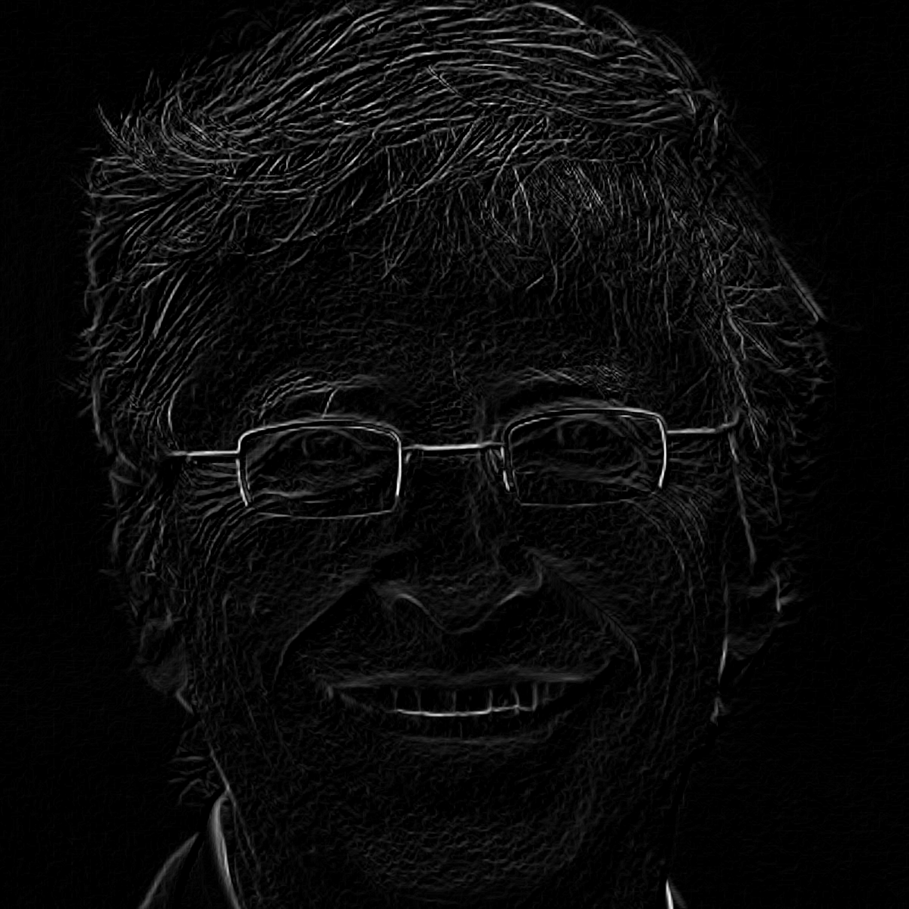

# PictureManipulator (a.k.a. EdgeDetector)
A fun little project implementing a few edge detection methods.  

This is a small project I did for fun, it implements the following methods:  
- Laplacian  
- Canny  
- Sobel  
All of which are popular edge detection algorithms.

An example of canny edge detection using my program:  
   

Now for a more creepy example using Bill Gates and Sobel edge detection:  
   
